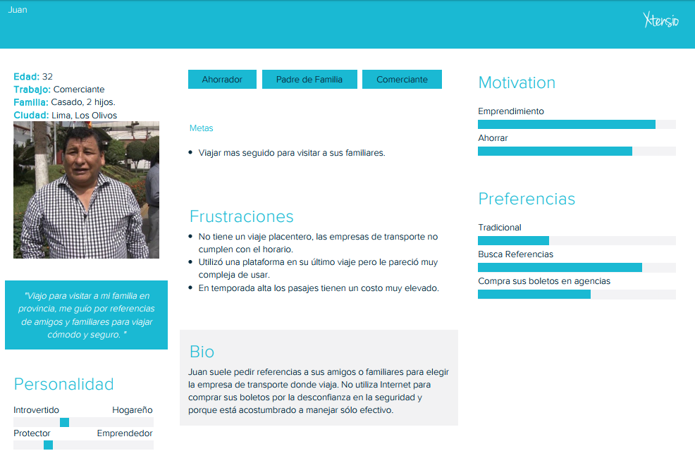
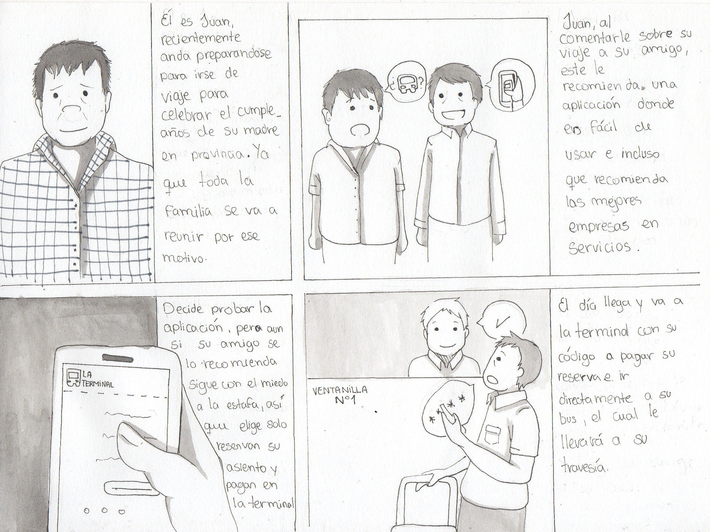
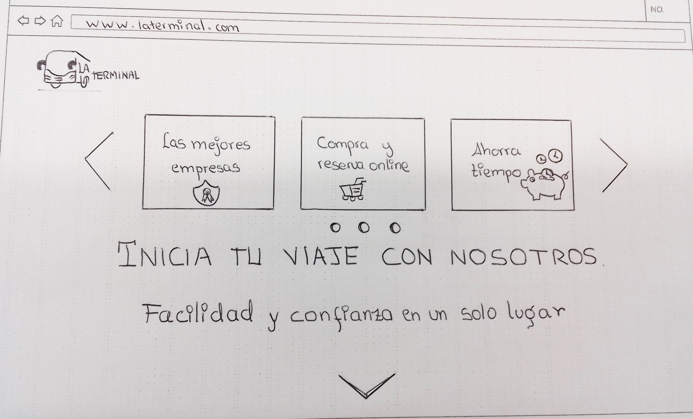
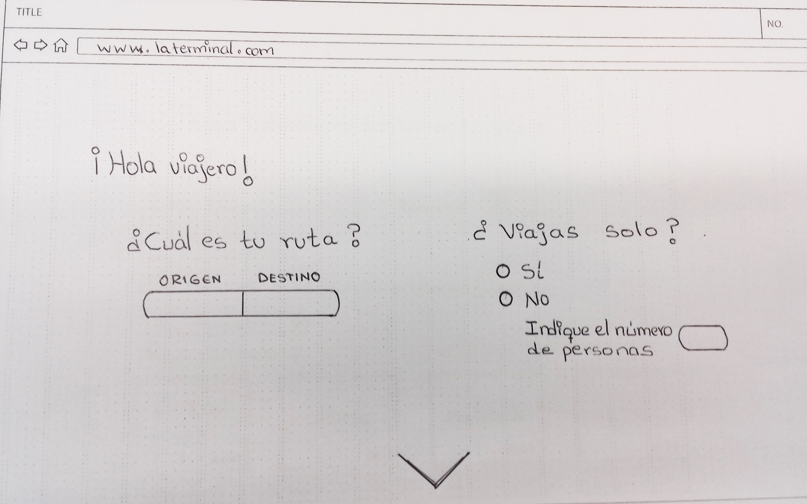
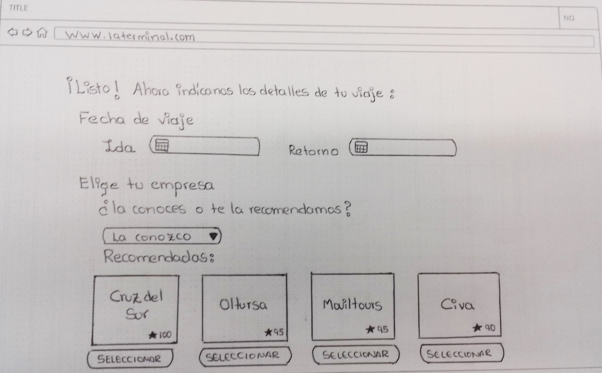
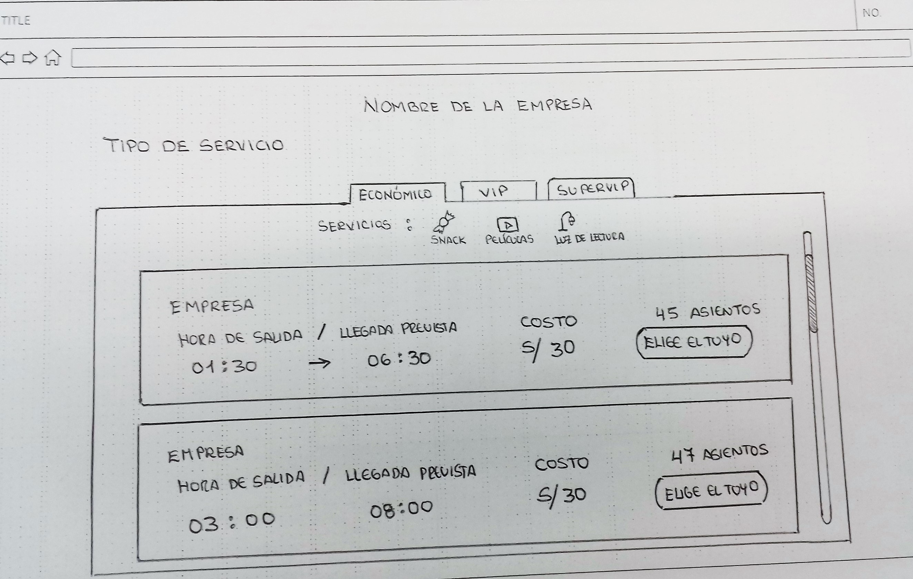
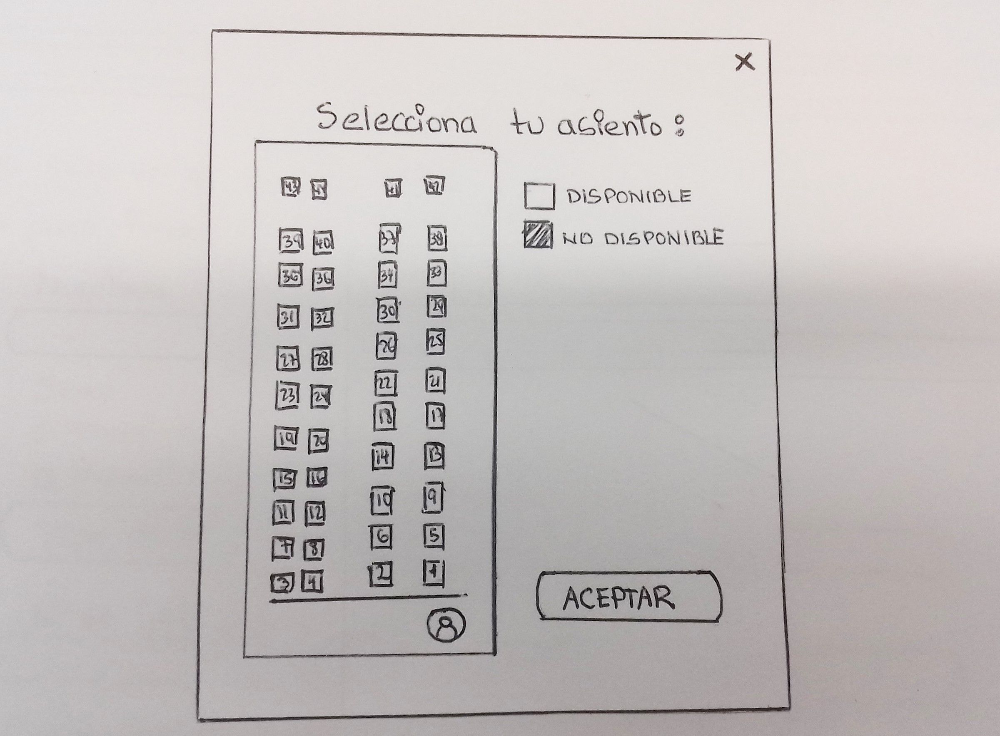
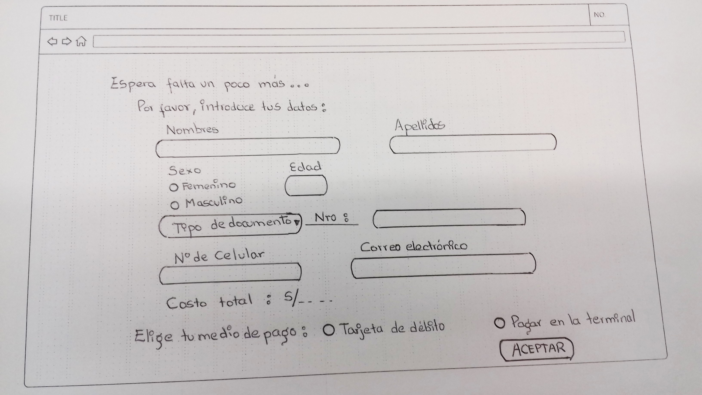
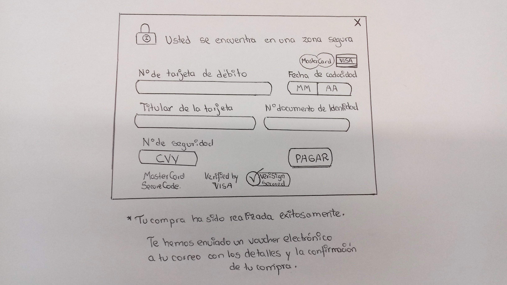
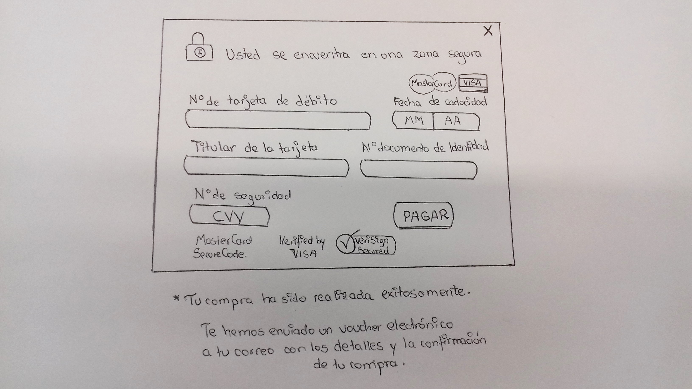

# La Terminal
___

La Terminal es una plataforma de venta de boletos de viaje vía terrestre. Diseñada para usuarios que buscan facilidad y rapidez en su compra.

## Desarrollado para

[Laboratoria](http://www.laboratoria.la/)

## Objetivo:

Diseñar la plataforma de venta de boletos de buses más intuitiva y amigable para el usuario.

## **Fases del Proceso:**

Para llevar a cabo el reto se siguió el proceso de UXD:
    

## **Descubrimiento e Investigación**

### **User Research:**

Metodologías utilizadas:

* _Research Cuantitativo:_ Encuestas por internet.

    - Encuesta Online [Click Aquí](https://goo.gl/forms/oxJzhOCSlwfiLDJk2)

* _Research Cualitativo:_ Entrevistas a usuarios en campo.

Las encuestas se realizaron el martes 30 del presente mes en dos puntos estratégicos: Terminales de buses ubicadas en 28 de Julio y Plaza Lima Norte.

**_Análisis situacional:_**

Analizada la data se obtuvo:

- Solo el 20% de los encuestados ha comprado pasajes por Internet alguna vez en su vida.

- Los usuarios con mejor predisposición a comprar vía Internet pertenecen al rango etario de 20 a 40 años.

- A más del 70% les genera desconfianza comprar por Internet.

- El 45% posiblemente compraría online previa recomendación y respaldo de la empresa.

_Fotos de la investigación:_  [Click Aqui!](https://photos.google.com/share/AF1QipNhjbtJdhZl_5NInrbAaW0SVUJ8yRCoweozimCIk9GZrEK-VH0fg5nIPoU-KuciCA?key=UEtzQ2tfcVFSWG9UVmkwYlIxOGVEQmxGb2liMC13)

## **Síntesis y Definición**

A partir los insights, se procedió a lo siguiente:

###  **Mapas de Afinidad (Affinity maps):**

    Mediante este, se agruparon los comentarios de los usuarios en siete aspectos claves: 
    Uso del internet, compra en agencias, servicios, temores de los usuarios, experiencia de viaje, costo de servicios y recomendaciones.

    

### **Selección del problema:** 

    Debido a que se notó un gran contraste entre los usuarios que compran sus pasajes vía internet vs. los que compran directamente en las agencias, se optó por elegir dicha problemática: ¿Por qué los peruanos no compran sus pasajes por internet?

### **Definición del problema:**
    Las respuestas que más usuarios nos dieron fue la siguiente: "No compro por internet porque me da miedo ser estafado". Y es precisamente ésta una de las razones por las que el peruano promedio no compra por internet. El usuario peruano siente desconfianza, inseguridad y en muchos casos no está familiarizado con las plataformas de compras por internet.

## **Ideación**

### **User Persona:**
    Se elaboró el siguiente perfil de nuestro público objetivo en base a la información de nuestros usuarios. 
     
    * _Juan, 32_: 
    

### **Problem Statements:**
    Los siguientes enunciados se apoyan en las necesidades de nuestro User Persona.

    - Juan necesita una plataforma segura que ofrezca servicios confiables, ya que teme ser estafado.

    - Juan necesita encontrar la información que busca de forma clara y precisa, porque el uso del internet se le complica.

    - Juan necesita un modo fácil y rápido de comprar sus boletos de viaje por internet para ahorrar tiempo.

### **HMW (How Might We o ¿Cómo podríamos?):**
    Se formularon las siguientes preguntas con el fin de entender mejor los problemas y desarrollar mejores hipótesis. 

    -  ¿Cómo podríamos hacer que nuestro usuario confíe en nuestra plataforma de venta de boletos?

    - ¿Cómo podríamos hacer fácil y entendible el proceso de compra de boletos online?

### **WHAT IF?:**
    Se plantearon los siguientes enunciados que nos ayudarán a considerar nuevos actores o circunstancias en el contexto del usuario.

    - WHAT IF dentro del proceso solo incluímos a empresas confiables.

    - WHAT IF el usuario no quiere pagar por internet. 

### **STORYTELLING:**
    Nos permite entender las necesidades del usuario y empatizar con él.

    Enlace: [Click](https://onedrive.live.com/view.aspx?resid=AE7D39D044B5FE3A!123&ithint=file%2cdocx&app=Word&authkey=!ANVVkkEzNcjSrp4)

### **USER FLOW:**
    Nos da un mayor entendimiendo de la experiencia que el usuario tiene con el flujo de nuestra plataforma.

     

### **MVP**
___

### **Feature List:**
    Muestra las características priorizadas según la necesidad de nuestro usuario.

    - Input de origen y destino del viaje.
    - Detalle de la fecha de ida y retorno.
    - Elección de empresa de transporte por recomendación de otros usuarios.
    - Filtro de categoría de servicios (Económico, Vip y Super Vip).
    - Servicios que se ofrecen en cada categoría (uso de iconografía).
    - Diagrama de asientos disponibles en el bus.
    - Reserva y/o compra de boletos.
    - Detalles de la compra realizada por el usuario (enviada al correo)
    - En caso de reservas, se envía un código al usuario para que pague en la terminal.

### **Storyboard:**
    Narra la visión de cómo será usada nuestra plataforma.
    
    

### **Content Prototyping:**
    En el siguiente enlace se muestra el flujo que tendrá nuestra plataforma.
    Siendo la primera versión, la inicial; y la segunda, la versión mejorada:

    * _Content Prototyping UXperts Versión 1 y 2:_  [Click](https://docs.google.com/document/d/1fhyF_XFbXCHkmn9zK0FfBFnAqS5JYaAb_LDYHZaELtc/edit)

## **Prototyping y Testing**

Se diseñó y testeó un primer prototipo de baja fidelidad.

_User Testing:_

![user2][2] 

[2]: assets/documents/user2.jpg

_Más fotos:_ [Link](https://photos.app.goo.gl/Xaips1XKF3Y58Wty2)

_Feedback_ recibido:

- Incluir los beneficios de la plataforma en una slider.
- Aclarar mejor la sección de empresas recomendadas
- Usar data real
- Enviar el código de reserva por mensaje de texto
- Necesitan algo que certifique la seguridad para los pagos online.

### **Prototipo Final:**

Teniendo el cuenta el _feedback_ recibido, se elaboró el prototipo mejorado:
 

### **Conclusión:**

La plataforma logra cumplir con los objetivos porque es fácil de usar, puesto que los usuarios que participaron del último testing así lo corroboran. Asimismo, se enfoca en el problema y logra cubrir las necesidades de nuestro usuario.

### **Enlaces Adicionales:**
   *  _Organización de actividades:_ [Trello](https://trello.com/b/lZvUFreL/la-traves%C3%ADa-por-un-boleto)

   * [Presentación Final](https://docs.google.com/presentation/d/16ltvKofrhhiAbmpmrVNZH4uVJ3n71ZjQd2yDUKQhAtQ/edit?usp=sharing)

### **Elaborado por: UXperts**
* [Franshesca Quezada](https://github.com/franshescaqm)
* [Yoanna Hernandez](https://github.com/YoannaHS)
* [Yasmin Mattos](https://github.com/YasminMattos)
* [Priscila Rojas](https://github.com/Priscilarojas)
* [Daniela Centeno](https://github.com/DDCenteno)
